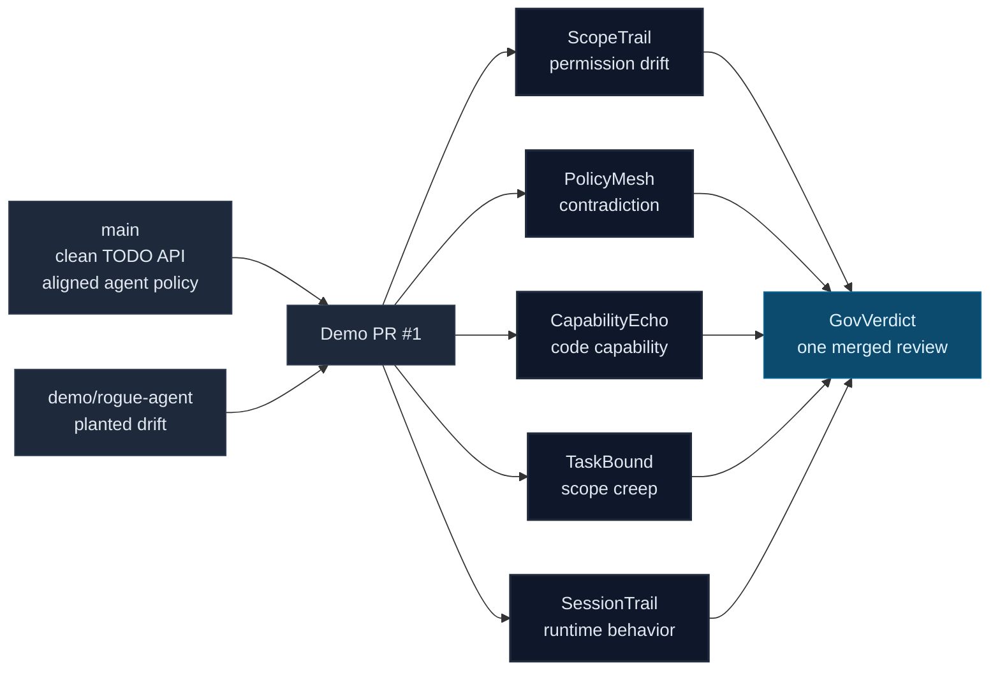

# agent-gov-demo

**A deliberately boring demo repo for the agent-gov suite.** `agent-gov-demo` is a tiny TODO API skeleton with clean agent policy on `main` and one rogue PR that plants every major drift class the suite is meant to catch.

The point is not the app. The point is the review surface: config drift, policy contradiction, code capability drift, task drift, transcript behavior, and one merged GovVerdict comment.

**Live demo:** [agent-gov-demo PR #1](https://github.com/Conalh/agent-gov-demo/pull/1)

## Why this exists

The agent-gov tools are easier to understand when they fire on the same PR. A suite explanation can sound abstract: one tool watches config, one watches current policy, one watches code capability, one watches task scope, one watches runtime transcripts, and GovVerdict merges the output.

This repo turns that into a concrete artifact. `main` is intentionally quiet. The rogue PR is intentionally suspicious. The resulting checks and comments show how the tools fit together.

## What's in the box

| File | Purpose |
| --- | --- |
| `src/index.js` | Minimal Node HTTP server with no dependencies. |
| `CLAUDE.md`, `.cursorrules`, `.mcp.json` | Declared agent surfaces, aligned on `main`. |
| `.claude/settings.json` | Modest baseline permission set: Read, Edit, `npm test`, `git status`. |
| `.github/workflows/agent-gov-review.yml` | Runs the suite plus [GovVerdict](https://github.com/Conalh/GovVerdict) consolidation on every PR. |
| `sample-review/` | The actual JSON reports and merged verdict captured from the rogue PR — committed proof, not a screenshot. |

## The rogue PR

[Pull request #1](https://github.com/Conalh/agent-gov-demo/pull/1) on branch `demo/rogue-agent` deliberately introduces every category of drift the suite catches:

| Tool | Drift planted |
| --- | --- |
| [ScopeTrail](https://github.com/Conalh/ScopeTrail) | Expanded `.claude/settings.json` permissions. |
| [PolicyMesh](https://github.com/Conalh/PolicyMesh) | `.cursorrules` contradicts `CLAUDE.md`. |
| [CapabilityEcho](https://github.com/Conalh/CapabilityEcho) | New outbound `fetch` to a telemetry host in `src/`. |
| [TaskBound](https://github.com/Conalh/TaskBound) | PR titled `fix: typo in README` but touches unrelated files. |
| [SessionTrail](https://github.com/Conalh/SessionTrail) | Transcript reads `.ssh` and pipes `curl` to shell. |
| [GovVerdict](https://github.com/Conalh/GovVerdict) | Consolidates all five reports into one PR verdict. |

The job fails on critical findings, so the PR check turns red by design.

The five tools emit **42 findings**, which GovVerdict dedupes by fingerprint to
**38 — 4 critical, 17 high, 17 medium** (consolidated rating: critical). Those
reports and the merged verdict are committed under
[`sample-review/`](sample-review/), so the numbers are verifiable in this repo
without re-running CI or trusting a screenshot.

## How to use this repo

Use it as a reference when wiring the suite into another repository:

1. Open [PR #1](https://github.com/Conalh/agent-gov-demo/pull/1).
2. Inspect the workflow, step summary, annotations, and GovVerdict comment.
3. Compare the planted drift table above to the actual files changed in the PR.
4. Copy the workflow shape into a real repo, starting with advisory thresholds before gating.

## Part of the agent-gov suite

| Repo | What it catches |
| --- | --- |
| [ScopeTrail](https://github.com/Conalh/ScopeTrail) | Agent config drift between PR base and head. |
| [PolicyMesh](https://github.com/Conalh/PolicyMesh) | Contradictory agent instructions and config drift that make behavior non-reproducible. |
| [CapabilityEcho](https://github.com/Conalh/CapabilityEcho) | Capability drift introduced by code, manifests, workflows, and Dockerfiles. |
| [TaskBound](https://github.com/Conalh/TaskBound) | Scope creep between the stated task and the actual diff. |
| [SessionTrail](https://github.com/Conalh/SessionTrail) | Risky runtime behavior in Cursor / Claude Code / Codex session transcripts. |
| [AgentPulse](https://github.com/Conalh/AgentPulse) | Live local trajectory verdicts for active agent sessions. |
| [GovVerdict](https://github.com/Conalh/GovVerdict) | Merges JSON reports from the tools above into one deduped review. |
| [agent-gov-core](https://github.com/Conalh/agent-gov-core) | Shared parsers, the canonical `Finding` schema, and `mergeFindings`. |

MIT.
